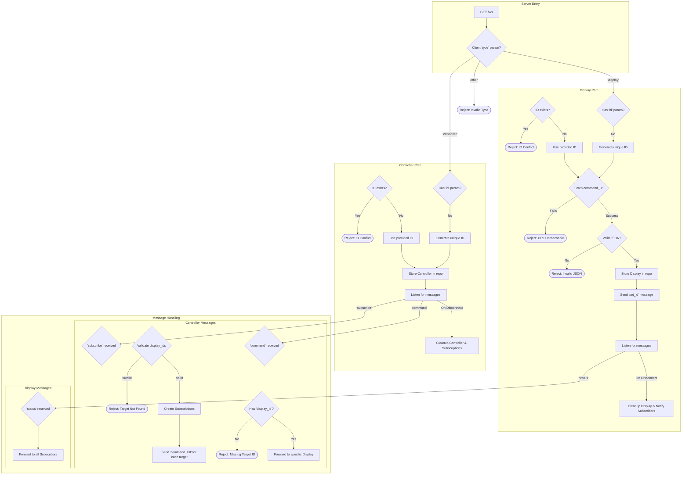

# Controly 專案詳細規劃 (多對多模型)

## 1. 系統目標與範疇

本專案旨在建立一個高效率、低延遲的即時通訊中繼系統。此系統允許「控制器 (Controller)」透過中介的「伺服器 (Server)」來探索並操作一個或多個遠端的「被控制器 (Display)」。同時，一個 Display 也能夠接收來自多個 Controller 的指令。系統核心功能為命令的轉發與狀態的同步，所有通訊將基於 WebSocket 協議，以確保雙向即時互動。

## 2. 系統架構

本系統由以下三個核心組件構成：

- **中繼伺服器 (Relay Server)**：作為通訊中樞，負責管理所有連線、驗證身份、儲存 Display 的命令集、並在 Controller 與 Display 之間安全地轉發訊息。
- **被控制器 (Display)**：任何需要被遠端操作的客戶端。它會定義一組可執行的命令，並透過 WebSocket 連線到伺服器進行註冊，等待來自 Controller 的指令。
- **控制器 (Controller)**：任何需要發起遠端操作的客戶端。它會向伺服器請求控制一個或多個 Display，接收其可用命令列表，並發送指令。

## 3. 核心組件詳述

### 3.1. 中繼伺服器 (Relay Server)

- **職責**:

    - **連線管理**: 維護與所有 Display 和 Controller 的 WebSocket 連線。
    - **ID 管理**: 為每個 Display 和 Controller 分配一個全域唯一的 ID。支援客戶端指定 ID，並在 ID 衝突時拒絕連線。若未提供 ID，伺服器將自動生成一個 8 個字元的 Base58 編碼 ID。
    - **命令快取**: Display 連線時，伺服器會擷取並快取其 `command.json` 的內容，供後續的 Controller 查詢。
    - **訊息路由**: 根據訊息的目標 ID，準確地在 Controller 和 Display 之間轉發 `command` 與 `status` 訊息。
    - **訂閱管理 (Subscription Management)**: 維護 Controller 與 Display 之間的訂閱關係。一個 Controller 可以訂閱多個 Display，一個 Display 也可以被多個 Controller 訂閱。

- **WebSocket 端點**: `ws://<server_address>/ws`

### 3.2. RESTful API 端點

除了 WebSocket 端點，伺服器也提供 RESTful API 以供查詢系統狀態。

- **列出所有連線 (`GET /api/connections`)**:

    - **目的**: 獲取目前所有活躍的 Display 和 Controller 連線，以及它們之間的訂閱關係。
    - **回應範例**:

    ```json
    {
    	"displays": [
    		{
    			"id": "display-1",
    			"subscribers": ["controller-A", "controller-B"]
    		},
    		{
    			"id": "display-2",
    			"subscribers": ["controller-A"]
    		}
    	],
    	"controllers": [
    		{
    			"id": "controller-A",
    			"subscriptions": ["display-1", "display-2"]
    		},
    		{
    			"id": "controller-B",
    			"subscriptions": ["display-1"]
    		}
    	]
    }
    ```

- **刪除指定 Display (`DELETE /api/displays/{id}`)**:

    - **目的**: 刪除指定 ID 的 Display 連線及其相關資料。所有訂閱該 Display 的 Controller 都會被解除訂閱。
    - **回應**: 成功時返回 `204 No Content`，如果 Display 不存在則返回 `404 Not Found`。

- **刪除指定 Controller (`DELETE /api/controllers/{id}`)**:
    - **目的**: 刪除指定 ID 的 Controller 連線及其相關資料。該 Controller 的所有訂閱關係都會被解除。
    - **回應**: 成功時返回 `204 No Content`，如果 Controller 不存在則返回 `404 Not Found`。

### 3.3. 被控制器 (Display)

- **連線生命週期**:
    1.  **註冊**: 透過 WebSocket 連線至伺服器，並在查詢參數中提供 `type=display`、`command_url` 以及選填的 `id`。
        - 範例: `ws://<server_address>/ws?type=display&command_url=https://example.com/commands.json&id=my-display`
    2.  **等待指令**: 成功註冊後，保持連線並監聽來自伺服器的 `command` 訊息。
    3.  **狀態更新**: 可主動發送 `status` 訊息給伺服器，伺服器會將此狀態廣播給所有訂閱了此 Display 的 Controller。
    4.  **斷線**: 連線中斷時，伺服器會自動註銷其註冊，並通知所有相關的 Controller。

### 3.4. 控制器 (Controller)

- **連線生命週期**:
    1.  **註冊**: 透過 WebSocket 連線至伺服器，並在查詢參數中提供 `type=controller` 及選填的 `id`。
        - 範例: `ws://<server_address>/ws?type=controller&id=my-controller`
    2.  **訂閱 Display**: 連線成功後，Controller 需要發送 `subscribe` 訊息來訂閱一個或多個 Display。
    3.  **接收命令集**: 訂閱成功後，伺服器會回傳目標 Display 的可用命令列表。
    4.  **發送指令**: 向伺服器發送 `command` 訊息來操作指定的 Display。
    5.  **接收狀態**: 監聽來自伺服器的 `status` 訊息，以獲取其訂閱的 Display 的最新狀態。

## 4. 通訊協議與資料流程 (多對多模型)

### 4.1. Display 註冊流程

1.  Display 發起 WebSocket 連線請求。
2.  Server 驗證 `command_url`，若無法存取或 JSON 格式錯誤，則連線失敗。
3.  Server 檢查 `id`，若被佔用，則連線失敗。若未提供 `id`，則生成一個 UUID。
4.  Server 儲存 Display 的資訊與命令集。
5.  Server 向 Display 發送成功註冊的訊息。

### 4.2. Controller 訂閱流程

1.  Controller 發起 WebSocket 連線請求並註冊。
2.  Controller 發送 `subscribe` 訊息，`payload` 中包含 `display_ids` 陣列。
3.  Server 驗證 `display_ids` 中的每個 Display 是否存在。若有任何 Display 不存在，則回傳錯誤。
4.  Server 建立 Controller 與目標 Display 之間的訂閱關係。
5.  Server 將每個目標 Display 的命令集 (`command_list`) 分別發送給 Controller。

## 5. 資料結構定義

### 5.1. WebSocket 訊息格式

所有透過 WebSocket 傳輸的資料都應為 JSON 格式。根據訊息的方向，有兩種結構：

- **客戶端 -> 伺服器 (Incoming)**:

    ```json
    {
    	"type": "<MessageType>",
    	"to": "<target_client_id>", // (選填) e.g., for 'command' messages
    	"payload": {}
    }
    ```

- **伺服器 -> 客戶端 (Outgoing)**:

    ```json
    {
    	"type": "<MessageType>",
    	"from": "<source_client_id>", // (選填) e.g., for 'status' or forwarded 'command'
    	"payload": {}
    }
    ```

- **訊息類型 (`MessageType`)**:

    - `set_id` (Server -> Client): 伺服器發送給客戶端的，告知其被分配的唯一 ID。
    - `command_list` (Server -> Controller): 伺服器發送給 Controller 的可用命令列表。`from` 會是目標 Display 的 ID。
    - `command` (Controller -> Server -> Display): Controller 發送給 Display 的指令。
        - C -> S: 需在 `to` 欄位指定目標 Display ID。
        - S -> D: 轉發時 `from` 欄位會是發出指令的 Controller ID。
    - `status` (Display -> Server -> Controller): Display 發送給 Controller 的狀態更新。
        - D -> S: Display 發送原始狀態。
        - S -> C: 轉發時 `from` 欄位會是來源 Display 的 ID。
    - `subscribe` (Controller -> Server): Controller 用於訂閱一個或多個 Display。
    - `unsubscribe` (Controller -> Server): Controller 用於取消訂閱。
    - `notification` (Server -> Client): 伺服器發送的通知，例如某個 Display 上線或下線。`from` 會是 "server"。
    - `subscribed` (Server -> Display): 伺服器發送給 Display 的，告知有新的 Controller 訂閱了它。`from` 會是 "server"。
    - `unsubscribed` (Server -> Display): 伺服器發送給 Display 的，告知有 Controller 取消訂閱或斷線。`from` 會是 "server"。
    - `error` (Server -> Client): 伺服器發送的錯誤通知。`from` 會是 "server"。

- **範例**:
    - **訂閱 (`subscribe`, C -> S)**:
        ```json
        {
        	"type": "subscribe",
        	"payload": {
        		"display_ids": ["display-1", "display-2"]
        	}
        }
        ```
    - **指令 (`command`, C -> S)**:
        ```json
        {
        	"type": "command",
        	"to": "display-1",
        	"payload": {
        		"name": "set_volume",
        		"args": {
        			"level": 80
        		}
        	}
        }
        ```
    - **狀態 (`status`, S -> C)**:
        ```json
        {
        	"type": "status",
        	"from": "display-1",
        	"payload": {
        		"playback_state": "playing",
        		"current_volume": 80
        	}
        }
        ```
    - **訂閱成功通知 (`subscribed`, S -> D)**:
        ```json
        {
        	"type": "subscribed",
        	"from": "server",
        	"payload": {
        		"count": 2
        	}
        }
        ```
    - **取消訂閱通知 (`unsubscribed`, S -> D)**:
        ```json
        {
        	"type": "unsubscribed",
        	"from": "server",
        	"payload": {
        		"count": 1
        	}
        }
        ```

## 6. 錯誤處理機制 (多對多模型)

伺服器在遇到問題時，會透過 `error` 類型的 WebSocket 訊息通知客戶端。此訊息的 `payload` 將包含 `code`（錯誤碼）和 `message`（錯誤描述）。

```json
{
	"type": "error",
	"payload": {
		"code": 1001,
		"message": "Request is missing required query parameter: type"
	}
}
```

### 6.1. Controller 連線/訂閱錯誤 (3xxx)

// TODO:

## 7. 流程圖 (多對多模型)



## 8. 適用於瀏覽器的 SDK

為簡化客戶端（包括 Display 和 Controller）與中繼伺服器的整合，我們將提供一個適用於瀏覽器環境的 JavaScript SDK。此 SDK 會封裝底層的 WebSocket 通訊細節，並提供一個事件驅動、易於使用的 API。

### 8.1. `controly.Display`

`Display` SDK 負責處理與伺服器的連線、註冊、接收指令並回報狀態。

#### 使用範例

```javascript
// 1. 引入 SDK
// <script src="https://<your-cdn>/controly-sdk.js"></script>

// 2. 建立 Display 實例
const display = new controly.Display({
	serverUrl: 'ws://localhost:8080/ws',
	id: 'my-unique-display-01', // 選填，若不提供，伺服器會自動分配
	commandUrl: 'https://example.com/commands.json', // 提供命令定義檔的 URL
})

// 3. 註冊命令處理函式
// 當 Controller 發送 'play_pause' 指令時，此函式會被觸發
display.command('play_pause', (command, fromControllerId) => {
	console.log(`Received command '${command.name}' from controller '${fromControllerId}'`)
	// 在此處執行實際的播放/暫停邏輯
	// ...

	// 執行後，更新狀態並通知所有訂閱者
	display.updateStatus({
		playback: 'playing',
		timestamp: Date.now(),
	})
})

// 註冊另一個指令 'set_volume'
display.command('set_volume', (command, fromControllerId) => {
	const volumeLevel = command.args.level
	console.log(`Setting volume to ${volumeLevel} as requested by ${fromControllerId}`)
	// 執行音量設定
	// ...

	// 更新狀態
	display.updateStatus({
		volume: volumeLevel,
	})
})

// 4. 監聽連線事件
display.on('open', id => {
	console.log(`Display connected to server with ID: ${id}`)
})

display.on('error', error => {
	console.error('An error occurred:', error.message)
})

display.on('close', () => {
	console.log('Connection closed.')
})

// 5. 連線至伺服器
display.connect()

// 6. 主動更新狀態
// 當內部狀態改變時（例如，使用者手動操作），可隨時更新
setInterval(() => {
	display.updateStatus({
		heartbeat: Date.now(),
	})
}, 30000)
```

#### API 詳述

- `new controly.Display(options)`: 建立一個 Display 實例。
    - `options.serverUrl` (string, required): 中繼伺服器的 WebSocket URL。
    - `options.id` (string, optional): 指定 Display 的 ID。
    - `options.commandUrl` (string, required): `command.json` 的 URL。
- `.connect()`: 啟動與伺服器的連線。
- `.disconnect()`: 關閉連線。
- `.on(eventName, callback)`: 註冊事件監聽器。
    - `eventName` (string): 事件名稱。可以是連線事件 (`open`, `close`, `error`, `subscribed`, `unsubscribed`) 。
    - `callback(payload, fromId)`: 事件觸發時的回呼函式。
- `.command(commandName, callback)`：註冊命令處理函數。
    - `commandName` (string)：命令名稱。不必要是 `command.json` 中的命令，不強制檢查。
    - `callback(args, fromID)`：收到命令時的回呼函式。
- `.updateStatus(statusPayload)`: 向所有訂閱的 Controller 廣播目前的狀態。
    - `statusPayload` (object): 任何可被序列化為 JSON 的物件。
- `.subscribers()`: 獲取目前訂閱此 Display 的 Controller 數量。
    - 回傳值 (number): 訂閱的 Controller 數量。

### 8.2. `controly.Controller`

`Controller` SDK 負責連線伺服器、訂閱 Display、接收其命令列表與狀態更新，並發送指令。

#### 使用範例

```javascript
// 1. 引入 SDK
// <script src="https://<your-cdn>/controly-sdk.js"></script>

// 2. 建立 Controller 實例
const controller = new controly.Controller({
	serverUrl: 'ws://localhost:8080/ws',
	id: 'my-remote-controller-A', // 選填
})

// 3. 監聽事件
controller.on('open', id => {
	console.log(`Controller connected with ID: ${id}`)
	// 連線成功後，訂閱感興趣的 Display
	controller.subscribe(['display-01', 'display-02'])
})

// 當成功訂閱並收到 Display 的命令列表時觸發
controller.on('command_list', data => {
	const { from, payload } = data
	console.log(`Received command list from Display '${from}':`, payload)
	// 在此處可以根據命令列表動態生成 UI 控制介面
	// e.g., renderButtons(payload);
})

// 監聽來自 Display 的狀態更新
controller.on('status', data => {
	const { from, payload } = data
	console.log(`Status update from Display '${from}':`, payload)
	// e.g., updateUI(from, payload);
})

controller.on('notification', notification => {
	console.info('Server notification:', notification.message)
})

controller.on('error', error => {
	console.error('An error occurred:', error.message)
})

// 4. 連線至伺服器
controller.connect()

// 5. 發送指令 (例如，在使用者點擊按鈕後)
function sendPlayCommand(displayId) {
	controller.sendCommand(displayId, {
		name: 'play_pause',
	})
}

function sendVolumeCommand(displayId, volume) {
	controller.sendCommand(displayId, {
		name: 'set_volume',
		args: { level: volume },
	})
}
```

#### API 詳述

- `new controly.Controller(options)`: 建立一個 Controller 實例。
    - `options.serverUrl` (string, required): 中繼伺服器的 WebSocket URL。
    - `options.id` (string, optional): 指定 Controller 的 ID。
- `.connect()`: 啟動與伺服器的連線。
- `.disconnect()`: 關閉連線。
- `.on(eventName, callback)`: 註冊事件監聽器。
    - `eventName`: `open`, `close`, `error`, `command_list`, `status`, `notification`。
    - `callback(payload)`: 事件觸發時的回呼函式。
- `.subscribe(displayIds)`: 訂閱一個或多個 Display。
    - `displayIds` (string[]): 目標 Display ID 的陣列。
- `.unsubscribe(displayIds)`: 取消訂閱。
- `.sendCommand(displayId, command)`: 向指定的 Display 發送指令。
    - `displayId` (string): 目標 Display 的 ID。
    - `command` (object): 指令物件，包含 `name` 及選填的 `args`。

## 附錄：命令定義與控制項類型

### 命令定義 (`command.json`)

此檔案定義了 Display 可執行的所有命令，其內容應為一個 JSON 陣列，每個物件代表一個 UI 控制項。

- **通用屬性**:
    - `name` (string, required): 命令的唯一識別碼。
    - `label` (string, required): 顯示在 UI 上的名稱。
    - `type` (string, required): 控制項的類型。

#### 控制項類型與範例

`command.json` 支援以下幾種控制項類型：

1.  **按鈕 (Button)**: 用於觸發一個無參數的動作。

    - `type`: `"button"`

2.  **文字輸入 (Text)**: 用於輸入單行文字。

    - `type`: `"text"`
    - `default` (string, optional): 預設值。
    - `regex` (string, optional): 用於驗證輸入內容的正規表示式。

3.  **數字輸入 (Number)**: 用於輸入���數或浮點數。

    - `type`: `"number"`
    - `default` (number, optional): 預設值。
    - `min` (number, optional): 最小值。
    - `max` (number, optional): 最大值。
    - `step` (number, optional): 步進值（例如 `1` 代表整數，`0.1` 代表浮點數）。

4.  **下拉選單 (Select)**: 用於從預設選項中選擇。

    - `type`: `"select"`
    - `options` (array, required): 選項陣列，每個物件包含 `label` 和 `value`。
    - `default` (string | number, optional): 預設選項的 `value`。

5.  **核取方塊 (Checkbox)**: 用於表示一個布林狀態（開/關）。
    - `type`: `"checkbox"`
    - `default` (boolean, optional): 預設的選中狀態 (`true` 或 `false`)。

#### 完整範例

```json
[
	{
		"name": "play_pause",
		"label": "播放/暫停",
		"type": "button"
	},
	{
		"name": "set_title",
		"label": "設定標題",
		"type": "text",
		"default": "預設標題",
		"regex": "^.{1,50}$"
	},
	{
		"name": "set_volume",
		"label": "音量",
		"type": "number",
		"default": 50,
		"min": 0,
		"max": 100,
		"step": 1
	},
	{
		"name": "set_speed",
		"label": "播放速度",
		"type": "number",
		"default": 1.0,
		"min": 0.5,
		"max": 2.0,
		"step": 0.1
	},
	{
		"name": "select_quality",
		"label": "畫質",
		"type": "select",
		"default": "720p",
		"options": [
			{ "label": "高畫質", "value": "1080p" },
			{ "label": "中等畫質", "value": "720p" },
			{ "label": "低畫質", "value": "480p" }
		]
	},
	{
		"name": "enable_loop",
		"label": "循環播放",
		"type": "checkbox",
		"default": false
	}
]
```
