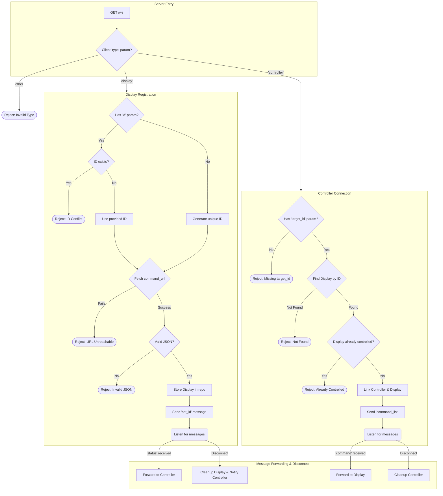

# Controly 專案詳細規劃

## 1. 系統目標與範疇

本專案旨在建立一個高效率、低延遲的即時通訊中繼系統。此系統允許「控制器 (Controller)」透過中介的「伺服器 (Server)」來探索並操作遠端的「被控制器 (Display)」。系統核心功能為命令的轉發與狀態的同步，所有通訊將基於 WebSocket 協議，以確保雙向即時互動。

## 2. 系統架構

本系統由以下三個核心組件構成：

- **中繼伺服器 (Relay Server)**：作為通訊中樞，負責管理所有連線、驗證身份、儲存 Display 的命令集、並在 Controller 與 Display 之間安全地轉發訊息。
- **被控制器 (Display)**：任何需要被遠端操作的客戶端。它會定義一組可執行的命令，並透過 WebSocket 連線到伺服器進行註冊，等待來自 Controller 的指令。
- **控制器 (Controller)**：任何需要發起遠端操作的客戶端。它會向伺服器請求控制指定的 Display，接收其可用命令列表，並發送指令。

## 3. 核心組件詳述

### 3.1. 中繼伺服器 (Relay Server)

- **職責**:

    - **連線管理**: 維護與所有 Display 和 Controller 的 WebSocket 連線。
    - **ID 管理**: 為每個 Display 分配一個全域唯一的 ID。支援客戶端指定 ID，並在 ID 衝突時拒絕連線。若未提供 ID，伺服器將自動生成一個 8 個字元的 Base58 編碼 ID (不包含容易混淆的字元，例如 O, 0, l, I)。
    - **命令快取**: Display 連線時，伺服器會擷取並快取其 `command.json` 的內容，供後續的 Controller 查詢。
    - **訊息路由**: 根據訊息的目標 ID，準確地在 Controller 和 Display 之間轉發 `command` 與 `status` 訊息。
    - **配對管理**: 維護 Controller 與 Display 之間的控制關係。目前系統的設計為一對一配對，即一個 Display 同一時間只能被一個 Controller 控制。未來的版本將考慮支援多對多關係，允許一個 Controller 同時控制多個 Display，或一個 Display 同時接收多個 Controller 的指令。

- **WebSocket 端點**: `ws://<server_address>/ws`

### 3.2. 被控制器 (Display)

- **連線生命週期**:
    1.  **註冊**: 透過 WebSocket 連線至伺服器，並在查詢參數中提供 `type=display`、`command_url` 以及選填的 `id`。
        - 範例: `ws://<server_address>/ws?type=display&command_url=https://example.com/commands.json&id=my-unique-display`
    2.  **等待指令**: 成功註冊後，保持連線並監聽來自伺服器的 `command` 訊息。
    3.  **狀態更新**: 可主動發送 `status` 訊息給伺服器，以同步其狀態至 Controller。
    4.  **斷線**: 連線中斷時，伺服器會自動註銷其註冊。

### 3.3. 控制器 (Controller)

- **連線生命週期**:
    1.  **請求控制**: 透過 WebSocket 連線至伺服器，並在查詢參數中提供 `type=controller` 及 `target_id` (目標 Display 的 ID)。
        - 範例: `ws://<server_address>/ws?type=controller&target_id=my-unique-display`
    2.  **接收命令集**: 連線成功後，伺服器會立即回傳目標 Display 的可用命令列表。
    3.  **發送指令**: 向伺服器發送 `command` 訊息來操作 Display。
    4.  **接收狀態**: 監聽來自伺服器的 `status` 訊息，以獲取 Display 的最新狀態。

## 4. 通訊協議與資料流程

### 4.1. Display 註冊流程

1.  Display 發起 WebSocket 連線請求。
2.  Server 驗證 `command_url`，若無法存取或 JSON 格式錯誤，則連線失敗。
3.  Server 檢查 `id`，若被佔用，則連線失敗。若未提供 `id`，則生成一個 UUID。
4.  Server 儲存 Display 的資訊與命令集。
5.  Server 向 Display 發送成功註冊的訊息。

### 4.2. Controller 控制流程

1.  Controller 發起 WebSocket 連線請求。
2.  Server 查找 `target_id` 對應的 Display 是否存在且可用。若否，則連線失敗。
3.  Server 建立 Controller 與 Display 的配對關係。
4.  Server 將快取的命令集發送給 Controller。

## 5. 資料結構定義

### 5.1. WebSocket 訊息格式

所有透過 WebSocket 傳輸的資料都應為 JSON 格式。

- **通用結構**:

    ```json
    {
    	"type": "<MessageType>",
    	"payload": {}
    }
    ```

- **訊息類型 (`MessageType`)**:

    - `set_id` (Server -> Display): 伺服器發送給 Display 的，告知其被分配的唯一 ID。
    - `command_list` (Server -> Controller): 伺服器發送給 Controller 的可用命令列表。
    - `command` (Controller -> Server -> Display): Controller 發送給 Display 的指令。
    - `status` (Display -> Server -> Controller): Display 發送給 Controller 的狀態更新。
    - `error` (Server -> Client): 伺服器發送的錯誤通知。

- **範例**:
    - **指令 (`command`)**:
        ```json
        {
        	"type": "command",
        	"payload": {
        		"name": "set_volume",
        		"args": {
        			"level": 80
        		}
        	}
        }
        ```
    - **狀態 (`status`)**:
        ```json
        {
        	"type": "status",
        	"payload": {
        		"playback_state": "playing",
        		"current_volume": 80
        	}
        }
        ```

## 5. 錯誤處理機制

伺服器在遇到問題時，會透過 `error` 類型的 WebSocket 訊息通知客戶端。此訊息的 `payload` 將包含 `code`（錯誤碼）和 `message`（錯誤描述）。

```json
{
	"type": "error",
	"payload": {
		"code": 1001,
		"message": "Request is missing required query parameter: type"
	}
}
```

以下是系統中可能發生的錯誤及其代碼：

### 5.1. 連線錯誤 (1xxx)

| Code   | Message                  | 說明                                                                               |
| :----- | :----------------------- | :--------------------------------------------------------------------------------- |
| `1001` | Invalid Query Parameters | 連線請求的查詢參數缺失或格式錯誤 (例如，缺少 `type`, `command_url`, `target_id`)。 |
| `1002` | Invalid Client Type      | `type` 參數的值不是 `display` 或 `controller`。                                    |

### 5.2. Display 註冊錯誤 (2xxx)

| Code   | Message                 | 說明                                                                               |
| :----- | :---------------------- | :--------------------------------------------------------------------------------- |
| `2001` | Command URL Unreachable | 伺服器無法存取 Display 提供的 `command_url`。                                      |
| `2002` | Invalid Command JSON    | 從 `command_url` 取得的內容不是有效的 JSON，或其結構不符合 `command.json` 的規範。 |
| `2003` | Display ID Conflict     | Display 嘗試註冊的 `id` 已被另一個活躍的 Display 使用。                            |

### 5.3. Controller 連線錯誤 (3xxx)

| Code   | Message                           | 說明                                                                |
| :----- | :-------------------------------- | :------------------------------------------------------------------ |
| `3001` | Target Display Not Found          | Controller 嘗試連線的 `target_id` 不存在或對應的 Display 不在線上。 |
| `3002` | Target Display Already Controlled | 該 Display 已被另一個 Controller 控制（在目前的一對一模型下）。     |

### 5.4. 通訊錯誤 (4xxx)

| Code   | Message                   | 說明                                                                                               |
| :----- | :------------------------ | :------------------------------------------------------------------------------------------------- |
| `4001` | Invalid Message Format    | 客戶端發送的訊息不是有效的 JSON��或不符合 `{ "type": "...", "payload": ... }` 的基本結構。         |
| `4003` | Invalid Command Arguments | 伺服器在轉發指令前，不會驗證指令名稱或參數的有效性。此錯誤碼僅作為範例，實際伺服器將直接轉發指令。 |

## 附錄：命令定義與控制項類型

### 命令定義 (`command.json`)

此檔案定義了 Display 可執行的所有命令，其內容應為一個 JSON 陣列，每個物件代表一個 UI 控制項。

- **通用屬性**:
    - `name` (string, required): 命令的唯一識別碼。
    - `label` (string, required): 顯示在 UI 上的名稱。
    - `type` (string, required): 控制項的類型。

#### 控制項類型與範例

`command.json` 支援以下幾種控制項類型：

1.  **按鈕 (Button)**: 用於觸發一個無參數的動作。

    - `type`: `"button"`

2.  **文字輸入 (Text)**: 用於輸入單行文字。

    - `type`: `"text"`
    - `default` (string, optional): 預設值。
    - `regex` (string, optional): 用於驗證輸入內容的正規表示式。

3.  **數字輸入 (Number)**: 用於輸入���數或浮點數。

    - `type`: `"number"`
    - `default` (number, optional): 預設值。
    - `min` (number, optional): 最小值。
    - `max` (number, optional): 最大值。
    - `step` (number, optional): 步進值（例如 `1` 代表整數，`0.1` 代表浮點數）。

4.  **下拉選單 (Select)**: 用於從預設選項中選擇。

    - `type`: `"select"`
    - `options` (array, required): 選項陣列，每個物件包含 `label` 和 `value`。
    - `default` (string | number, optional): 預設選項的 `value`。

5.  **核取方塊 (Checkbox)**: 用於表示一個布林狀態（開/關）。
    - `type`: `"checkbox"`
    - `default` (boolean, optional): 預設的選中狀態 (`true` 或 `false`)。

#### 完整範例

```json
[
	{
		"name": "play_pause",
		"label": "播放/暫停",
		"type": "button"
	},
	{
		"name": "set_title",
		"label": "設定標題",
		"type": "text",
		"default": "預設標題",
		"regex": "^.{1,50}$"
	},
	{
		"name": "set_volume",
		"label": "音量",
		"type": "number",
		"default": 50,
		"min": 0,
		"max": 100,
		"step": 1
	},
	{
		"name": "set_speed",
		"label": "播放速度",
		"type": "number",
		"default": 1.0,
		"min": 0.5,
		"max": 2.0,
		"step": 0.1
	},
	{
		"name": "select_quality",
		"label": "畫質",
		"type": "select",
		"default": "720p",
		"options": [
			{ "label": "高畫質", "value": "1080p" },
			{ "label": "中等畫質", "value": "720p" },
			{ "label": "低畫質", "value": "480p" }
		]
	},
	{
		"name": "enable_loop",
		"label": "循環播放",
		"type": "checkbox",
		"default": false
	}
]
```

# flowchart


