# API
## 客戶端註冊
伺服器產生 uuid
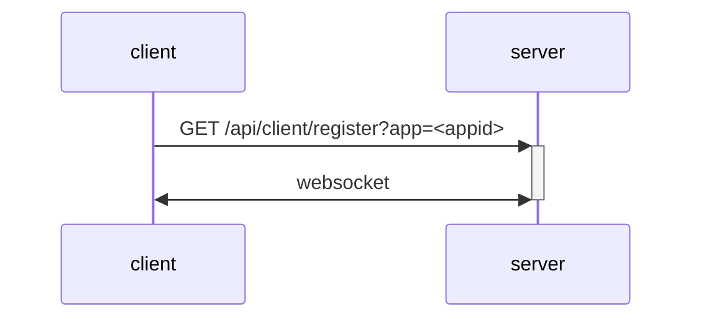
客戶端指定
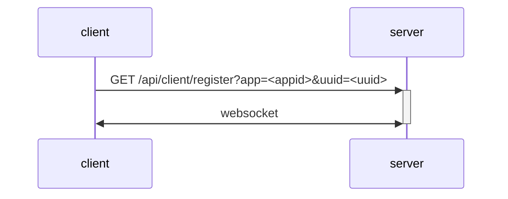
## 管理端註冊
管理端所有操作都在 websocket 裡
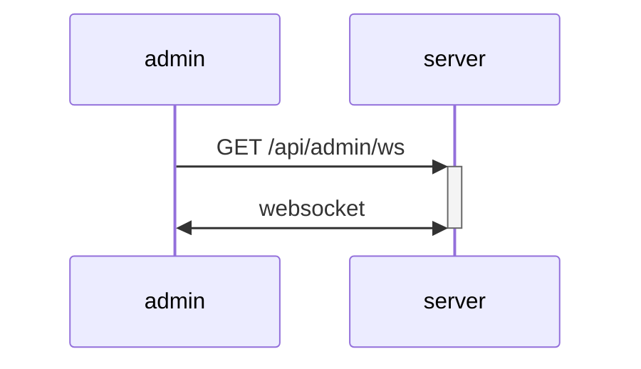
## 管理端連接客戶端
> in websocket
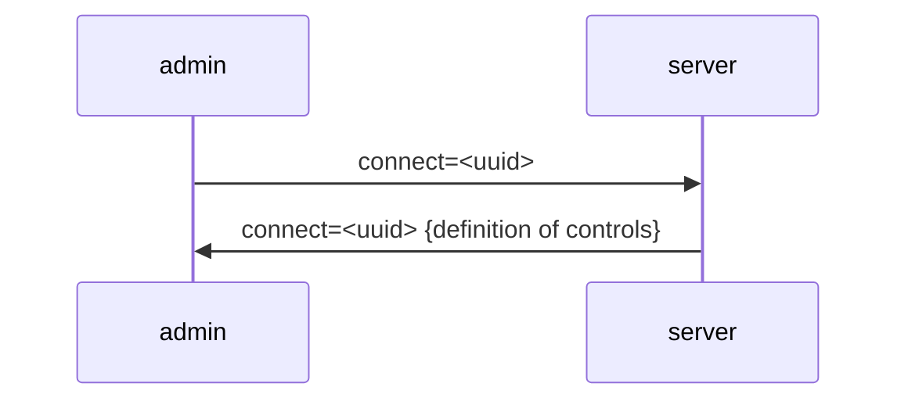
## 管理端執行某個動作（含修改某個值）
> in websocket
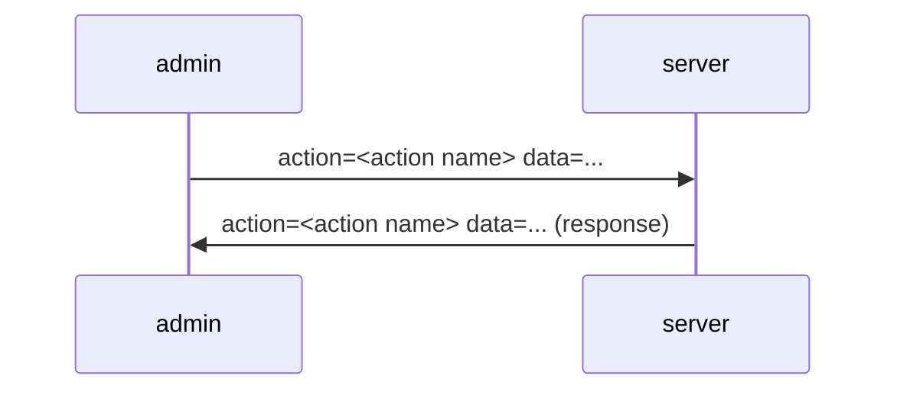
## 客戶端主動更新狀態
> in websocket
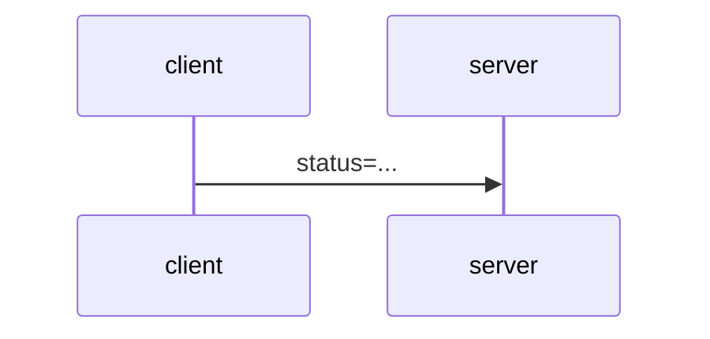
## 伺服器通知管理端狀態更新
> in websocket
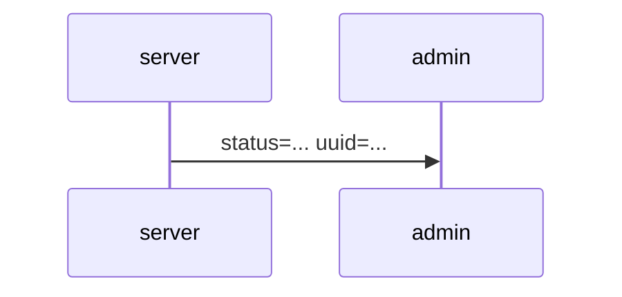
## 客戶端向其他客戶端廣播訊息
> in websocket
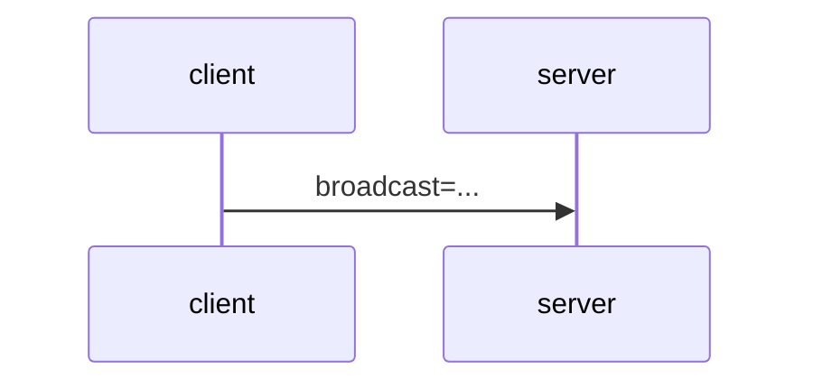
限制只向某些客戶端發送（考慮要不要限制必須是同一個 App）
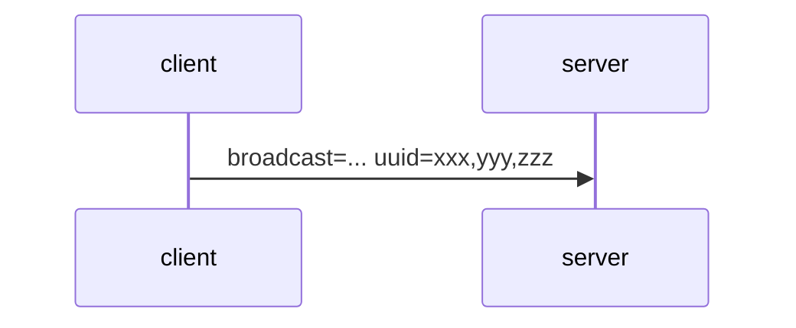
## 取得 App 內的客戶端
> in websocket
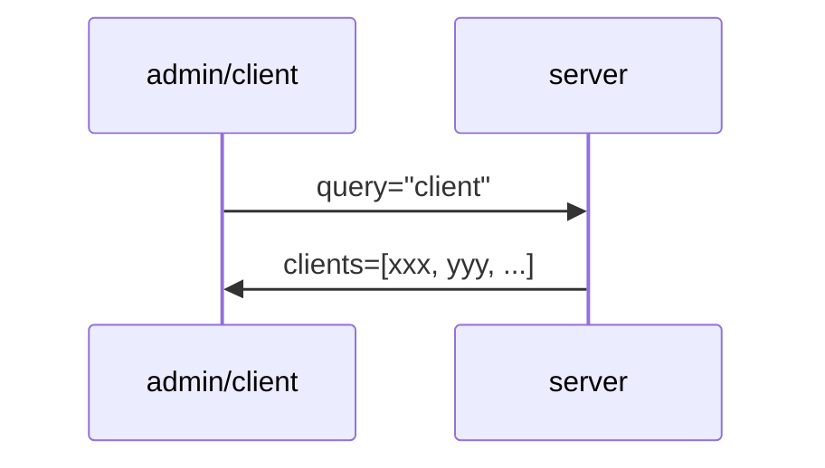
## App
App 是指一套關於如何控制客戶端的設定，使用密碼可以修改 App。有一套基本的 CURD API 可以建立、修改、查詢、刪除
POST /api/app
PUT /api/app/\<app>
GET /api/app
GET /api/app/\<app>
DELETE /api/app/\<app>

```typescript
type App = {
	name: string
	password: string // not exported
	controls: Control[]
}
```
# Control Definition
```typescript
type Control = {
	id: string
	type: 'button'
	value: string
} | {
	id: string
	type: 'number'
	min?: number
	max?: number
	step?: number
} | {
	id: string
	type: 'string'
}
```

# 簡介
須事先定義 app，app 是一堆 control 的集合，例如有按鈕、文字框、數字框等等。
client 連線到 server 時可以主動提供預先分配好的 uuid，或是由伺服器指定，並且告訴伺服器他所屬於的 app，同時建立 websocket 連線。
admin 透過手動輸入、QRCode 之類的機制取得 uuid 後，向 server 取得 app 設定，然後根據 app 設定顯示相應的控制 UI。
admin 可以向 server 送出要控制哪個 client 的哪個 control，client 也可以主動向 server 更新某個狀態，然後由 server 向對這個 client 有連線的 admin 發送狀態更新。
# 例子
一個倒數計時網頁，client 只有一個大大的時間，剩下的控制界面都在 admin。
## client
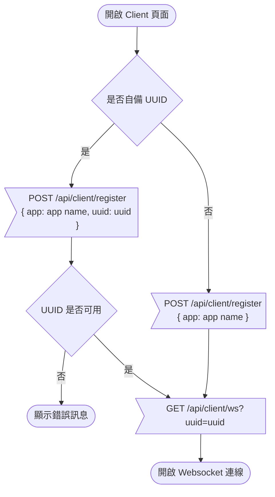
client 建立 websocket 連線後註冊相關 control
```
client.on('start', timer.start)
client.on('pause', timer.pause)
client.on('restart', timer.restart)
client.on('set', timer.set) // timer.set = (number) => void
```
接著 client 會自動在收到相對應的 websocket 請求時執行函數。另外當 `timer.start` 被執行時，會向 server 更新 `timer.time` `client.updateStatue({ time: timer.time, counting: true })`

## admin
admin 打開網頁後，建立一個 websocket 連線。然後輸入一個或多個 client 的 uuid，伺服器回傳 client 的 app 設定，接著顯示對應的控制畫面。並且在接收到 status 的通知時更新畫面。
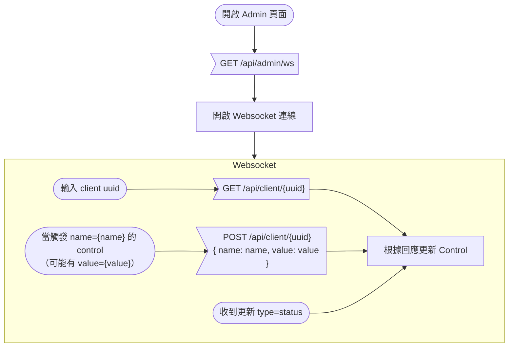
# struct
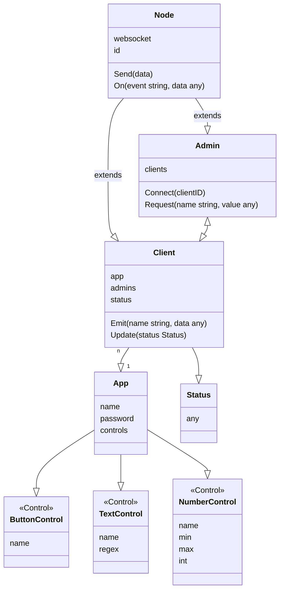
```go
type Admin struct {
	id string // uuid
	clients []Client
}

type Client struct {
	id string // uuid
	app *App
}

type App struct {
	name string
	password string
	controls []Control
}

type Control struct {
	name string
	type string
}
```
