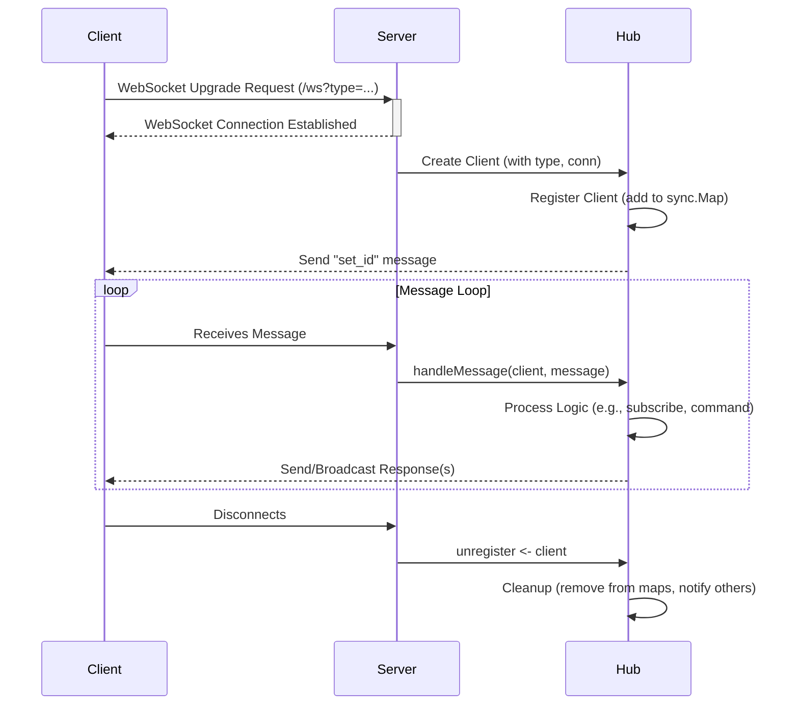
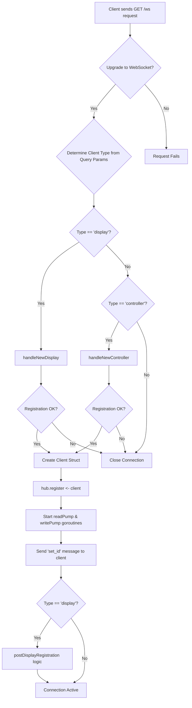
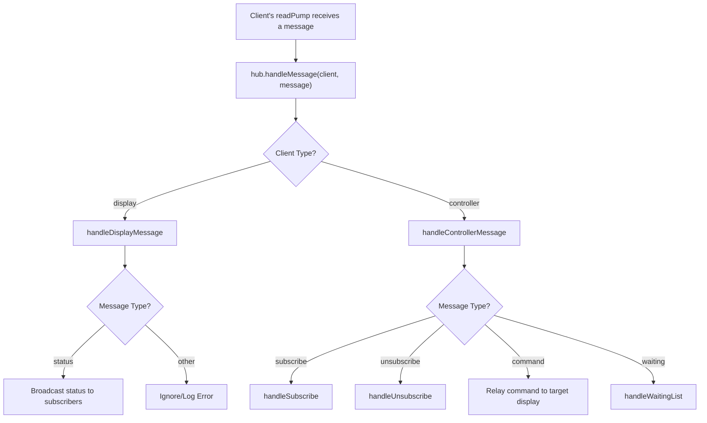

### Sequence Diagram

```mermaid
sequenceDiagram
    participant Client
    participant Server
    participant Hub

    Client->>+Server: WebSocket Upgrade Request (/ws?type=...)
    Server-->>-Client: WebSocket Connection Established

    Server->>Hub: Create Client (with type, conn)
    Hub->>Hub: Register Client (add to sync.Map)
    Hub-->>Client: Send "set_id" message

    loop Message Loop
        Client->>Server: Receives Message
        Server->>Hub: handleMessage(client, message)
        Hub->>Hub: Process Logic (e.g., subscribe, command)
        Hub-->>Client: Send/Broadcast Response(s)
    end

    Client->>Server: Disconnects
    Server->>Hub: unregister <- client
    Hub->>Hub: Cleanup (remove from maps, notify others)

```

### Flowchart - Client Connection

```mermaid
graph TD
    A[Client sends GET /ws request] --> B{Upgrade to WebSocket?};
    B -- Yes --> C{Determine Client Type from Query Params};
    B -- No --> D[Request Fails];

    C --> E{Type == 'display'?};
    E -- Yes --> F[handleNewDisplay];
    E -- No --> G{Type == 'controller'?};
    G -- Yes --> H[handleNewController];
    G -- No --> I[Close Connection];

    F --> J{Registration OK?};
    J -- Yes --> K[Create Client Struct];
    J -- No --> I;

    H --> L{Registration OK?};
    L -- Yes --> K;
    L -- No --> I;

    K --> M[hub.register <- client];
    M --> N[Start readPump & writePump goroutines];
    N --> O[Send 'set_id' message to client];
    O --> P{Type == 'display'?};
    P -- Yes --> Q[postDisplayRegistration logic];
    P -- No --> R[Connection Active];
    Q --> R;

```

### Flowchart - Message Handling

```mermaid
graph TD
    A[Client's readPump receives a message] --> B["hub.handleMessage(client, message)"];
    B --> C{Client Type?};
    C -- display --> D[handleDisplayMessage];
    C -- controller --> E[handleControllerMessage];

    D --> F{Message Type?};
    F -- status --> G[Broadcast status to subscribers];
    F -- other --> H[Ignore/Log Error];

    E --> I{Message Type?};
    I -- subscribe --> J[handleSubscribe];
    I -- unsubscribe --> K[handleUnsubscribe];
    I -- command --> L[Relay command to target display];
    I -- waiting --> M[handleWaitingList];
```
